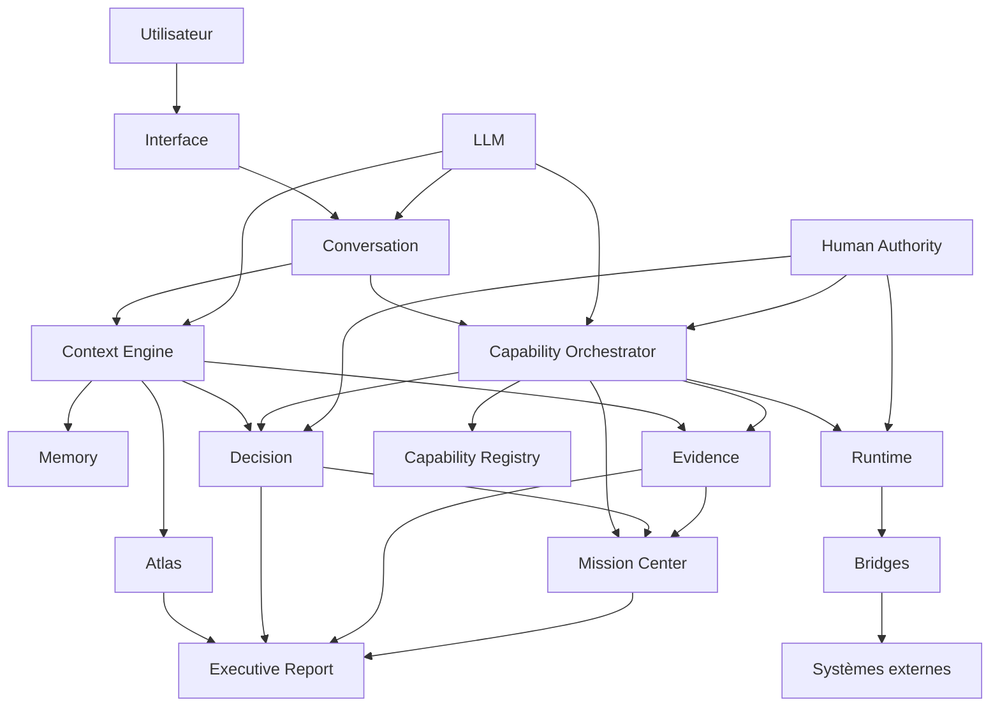
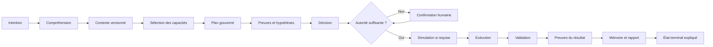
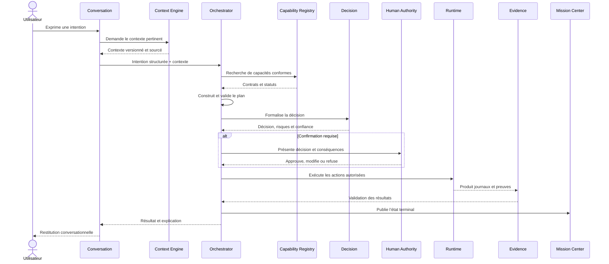
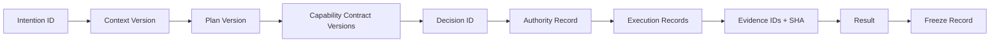
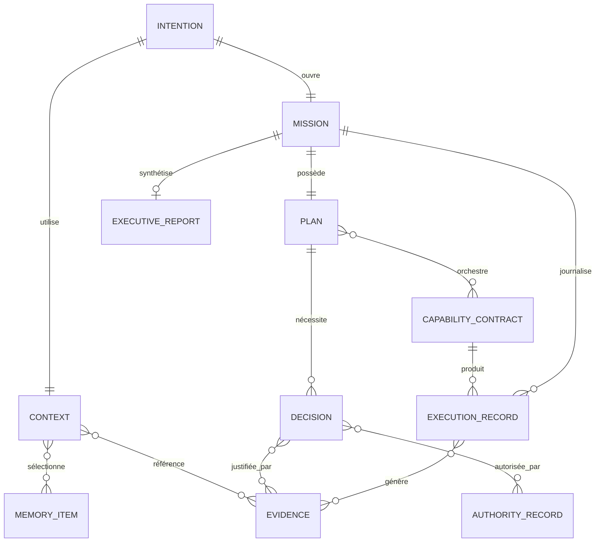

# SUPRA Executive Operating System — Constitution V1

| Champ | Valeur |
|---|---|
| Mission | `SUPRA_EXECUTIVE_OS_CONSTITUTION_V1` |
| Statut | `FREEZE` |
| Version | `1.0.0` |
| Nature | Architecture constitutionnelle |
| Autorité | Référence canonique du SUPRA Executive Operating System |
| Portée | Toutes les futures missions de conception, d’implémentation, de validation et d’exploitation |
| Mutation du dépôt | Aucune |
| Runtime modifié | Non |
| Implémentation produite | Aucune |

## Préambule normatif

La présente Constitution définit la vision, les frontières, les responsabilités, les contrats et les invariants du SUPRA Executive Operating System.

Elle constitue l’autorité architecturale supérieure de SUPRA. Les futures missions peuvent préciser ou implémenter ses contrats, mais ne doivent ni altérer sa vision, ni contourner ses principes, ni introduire une architecture concurrente.

Dans ce document :

- **DOIT** désigne une obligation.
- **NE DOIT PAS** désigne une interdiction.
- **DEVRAIT** désigne une règle dont toute exception exige une justification et une preuve.
- **PEUT** désigne une possibilité compatible avec la Constitution.
- **PASS** signifie qu’un contrat est démontré par des preuves suffisantes.
- **FREEZE** signifie qu’un périmètre est stable, traçable, reproductible et protégé contre les mutations non autorisées.

---

# 1. Vision

SUPRA existe pour transformer une intention humaine en compréhension, décision et exécution gouvernée.

La conversation est l’interface unique entre l’utilisateur et le système. L’utilisateur ne pilote pas des modules, ne compose pas des pipelines et ne choisit pas des workflows techniques. Il exprime un objectif, une question, une contrainte ou une décision.

SUPRA :

1. comprend l’intention ;
2. retrouve le contexte pertinent ;
3. identifie les capacités nécessaires ;
4. vérifie les autorités et préconditions ;
5. orchestre les capacités ;
6. rassemble et valide les preuves ;
7. expose les hypothèses, scénarios et risques ;
8. sollicite l’autorité humaine lorsque nécessaire ;
9. exécute les actions autorisées ;
10. journalise et explique le résultat.

Toutes les fonctions du système sont exposées comme des **capacités contractuelles**. Les modules, services, bridges, modèles, moteurs et mécanismes d’exécution sont des détails internes.

Le runtime existe pour servir l’intention. Il est invisible dans l’expérience normale et visible uniquement lorsqu’une preuve, une explication, un diagnostic ou une intervention d’autorité l’exige.

L’utilisateur dirige par l’intention. SUPRA orchestre par contrat.

---

# 2. Principes fondateurs

## 2.1 Conversation First

La conversation est le point d’entrée canonique.

Toute opération utilisateur DOIT pouvoir commencer par une expression en langage naturel. Une interface spécialisée PEUT assister l’utilisateur, mais NE DOIT PAS devenir une condition nécessaire à l’expression d’une intention.

SUPRA DOIT gérer l’ambiguïté explicitement. Une intention irréversible, risquée ou insuffisamment déterminée NE DOIT PAS être exécutée sur la base d’une supposition silencieuse.

## 2.2 Capability First

Toute fonction opérationnelle DOIT être décrite comme une capacité possédant un contrat stable.

L’orchestration dépend des contrats de capacité, jamais d’une connaissance implicite de leur implémentation. Une interface NE DOIT PAS invoquer directement un module d’exécution.

## 2.3 Memory First

SUPRA DOIT rechercher le contexte et la mémoire autorisés avant de demander à l’utilisateur de répéter une information déjà connue.

La mémoire ne vaut toutefois pas vérité absolue. Toute donnée mémorisée DOIT conserver sa provenance, sa portée, son ancienneté et son niveau de confiance.

## 2.4 Evidence First

Toute affirmation opérationnelle, décision substantielle, validation ou déclaration de succès DOIT être reliée à une preuve identifiable.

L’absence de preuve DOIT être signalée. Elle NE DOIT PAS être transformée en succès présumé.

## 2.5 Decision First

Une action significative DOIT découler d’une décision explicite ou d’une politique préalablement autorisée.

La décision précède l’exécution. Elle expose au minimum l’objectif, les hypothèses, les alternatives pertinentes, les risques, l’autorité et la justification.

## 2.6 Execution First

SUPRA vise un résultat vérifiable, pas seulement une recommandation.

Lorsqu’une action est autorisée et réalisable, SUPRA DEVRAIT conduire le cycle jusqu’à un état terminal démontré : succès, échec, annulation, rollback ou blocage explicite.

## 2.7 Human Authority

L’humain conserve l’autorité finale.

SUPRA NE DOIT PAS contourner une confirmation, une permission, une politique ou un refus humain. Le silence ne vaut pas autorisation pour une mutation importante ou irréversible.

## 2.8 Traceability

Chaque mission DOIT permettre de relier :

`intention → contexte → capacités → preuves → décision → autorité → actions → résultat`.

Cette chaîne DOIT être consultable sans dépendre de la mémoire volatile du modèle.

## 2.9 Explainability

SUPRA DOIT pouvoir expliquer :

- ce qu’il a compris ;
- quelles sources il a utilisées ;
- quelles hypothèses il a retenues ;
- quelles capacités il a sélectionnées ;
- pourquoi une décision ou une action a été choisie ;
- ce qui demeure incertain ;
- ce qui a changé.

Une explication ne doit pas révéler des secrets, identifiants ou données non autorisées.

## 2.10 Determinism

À entrées, versions, contexte, politiques et preuves identiques, les décisions contractuelles et les effets observables DEVRAIENT être reproductibles.

Toute part non déterministe DOIT être isolée, déclarée et bornée par des validations déterministes.

## 2.11 No Hidden Mutation

Aucune mutation ne doit être invisible.

Toute mutation DOIT avoir :

- une intention ou décision source ;
- une autorité ;
- une cible résolue ;
- une description préalable lorsque nécessaire ;
- un résultat ;
- une trace ;
- une stratégie de récupération lorsque applicable.

La lecture, la simulation et l’exécution DOIVENT rester distinguables.

## 2.12 Canonical Sources

Chaque catégorie de vérité DOIT posséder une source canonique déclarée.

Une vue, un cache, une mémoire ou une synthèse ne devient pas canonique par simple usage. En cas de divergence, la source canonique prévaut jusqu’à résolution formelle du conflit.

## 2.13 Freeze Discipline

Un composant ou contrat n’est gelable que s’il est :

- complet dans son périmètre ;
- validé ;
- traçable ;
- reproductible ;
- versionné ;
- dépourvu de blocker connu ;
- accompagné de preuves ;
- protégé contre les mutations implicites.

`PASS` ne signifie pas automatiquement `FREEZE`. Le freeze requiert une décision de gouvernance distincte.

---

# 3. Les couches

## 3.1 Interface

Présente l’état et recueille les intentions.

Elle NE DOIT PAS contenir de logique d’orchestration, décider de l’autorité ni manipuler directement le runtime. Elle rend accessibles la conversation, les confirmations, les explications, les décisions, les missions, les preuves et les rapports.

## 3.2 Conversation

Transforme les échanges en intentions structurées.

Elle gère la continuité du dialogue, les ambiguïtés, les clarifications, les confirmations et la restitution. Elle ne constitue ni une mémoire canonique ni une autorité d’exécution.

## 3.3 Context Engine

Construit le contexte actif d’une intention.

Il sélectionne les éléments pertinents dans la conversation, la mémoire, les politiques, les décisions, Atlas, les preuves et l’état du runtime. Il produit un contexte versionné avec provenance, portée et fraîcheur.

## 3.4 Capability Orchestrator

Établit et supervise le plan d’action.

Il sélectionne les capacités à partir de leurs contrats, les ordonne, contrôle leurs préconditions, applique les politiques, gère les erreurs et maintient la trace de mission.

Il ne remplace ni l’autorité humaine ni les sources canoniques.

## 3.5 Capability Registry

Répertoire canonique des capacités disponibles et de leurs contrats.

Il expose leur identité, leur version, leur statut, leurs entrées, sorties, permissions, dépendances et critères de validation.

Une capacité absente, désactivée, incompatible ou non validée NE DOIT PAS être sélectionnée comme disponible.

## 3.6 Memory

Conserve les connaissances autorisées au-delà d’une interaction.

Elle sépare les types de mémoire et leurs politiques. Elle NE DOIT PAS devenir une collection opaque de conversations ni une source de vérité dépourvue de provenance.

## 3.7 Evidence

Enregistre, valide et relie les preuves.

Cette couche gère les références canoniques, l’intégrité, les empreintes, la provenance, les versions, la confiance et les relations entre preuves et affirmations.

## 3.8 Decision

Formalise les décisions.

Elle gère hypothèses, scénarios, risques, recommandations, autorité, confiance, justification et cycle de vie. Elle sépare clairement recommandation, approbation et décision effective.

## 3.9 Mission Center

Expose l’état opérationnel des missions.

Il présente objectifs, progression, étapes, capacités engagées, blocages, décisions, preuves et résultats. Il est une projection gouvernée de l’état de mission, pas une source parallèle.

## 3.10 Atlas

Décrit la structure du système et de son environnement.

Atlas maintient les relations entre domaines, projets, ressources, services, capacités, propriétaires, dépendances et sources canoniques. Il permet l’orientation et l’analyse d’impact.

Atlas décrit ; il n’exécute pas.

## 3.11 Executive Report

Produit une synthèse décisionnelle traçable.

Chaque conclusion du rapport DOIT être reliée à des preuves et décisions. Le rapport distingue faits, interprétations, recommandations, risques, inconnues et actions.

## 3.12 Runtime

Exécute les opérations autorisées.

Le runtime expose des résultats structurés, des erreurs explicites, des journaux et des preuves. Il NE DOIT PAS décider seul des objectifs, des permissions ou de la gouvernance.

## 3.13 Bridge

Adapte un système externe ou historique au contrat SUPRA.

Un bridge traduit protocoles et données sans devenir une source métier concurrente. Il DOIT déclarer ses transformations, limites, erreurs et versions.

## 3.14 LLM

Le LLM contribue à la compréhension, à la synthèse, à la planification et à l’explication.

Il n’est ni source canonique, ni mémoire durable, ni autorité, ni preuve. Toute sortie ayant un effet opérationnel DOIT être bornée par des contrats, politiques et validations déterministes.

## 3.15 Règles de dépendance

- L’Interface dépend de projections et de contrats, jamais directement du Runtime.
- La Conversation sollicite le Context Engine et l’Orchestrator.
- L’Orchestrator consulte le Registry ; il ne découvre pas les capacités par convention cachée.
- Le Runtime n’écrit dans la Memory, l’Evidence ou la Decision que via leurs contrats.
- Les Bridges restent sous le Runtime ou sous une capacité d’adaptation.
- Le LLM ne contourne aucune couche d’autorité.
- Mission Center, Atlas et Executive Report sont des projections spécialisées de sources gouvernées.
- Aucune couche ne doit créer une deuxième source canonique pour la même vérité.

---

# 4. Contrat des capacités

Chaque capacité DOIT posséder un manifeste contractuel versionné.

| Champ | Exigence |
|---|---|
| Nom | Identifiant unique, stable, non ambigu |
| Mission | Résultat métier produit et limites du périmètre |
| Inputs | Schéma, types, caractère requis, origine et contraintes |
| Outputs | Schéma, états terminaux, erreurs et preuves produites |
| Evidence requise | Preuves nécessaires avant exécution ou validation |
| Permissions | Autorités minimales par type d’action et de ressource |
| Préconditions | Conditions vérifiables avant démarrage |
| Postconditions | Invariants garantis après chaque état terminal |
| Statut | État opérationnel et niveau de maturité |
| Critères PASS | Conditions démontrant la conformité fonctionnelle |
| Critères FREEZE | Conditions démontrant stabilité et reproductibilité |

## 4.1 Identité et version

L’identité logique d’une capacité est stable. Toute évolution incompatible exige une nouvelle version de contrat.

Une implémentation DOIT déclarer précisément la version du contrat qu’elle satisfait.

## 4.2 Statuts normatifs

Une capacité peut être :

- `DRAFT` : contrat incomplet ;
- `REGISTERED` : contrat complet, non validé ;
- `VALIDATING` : validation en cours ;
- `ACTIVE` : sélectionnable ;
- `DEGRADED` : disponible avec limites déclarées ;
- `SUSPENDED` : temporairement non sélectionnable ;
- `FAILED` : non conforme ;
- `DEPRECATED` : encore accessible sous conditions ;
- `FROZEN` : version stable, prouvée et protégée ;
- `RETIRED` : indisponible pour les nouvelles missions.

## 4.3 Invariants

Une capacité :

- NE DOIT PAS élargir ses permissions pendant l’exécution ;
- NE DOIT PAS produire d’effet hors de sa mission déclarée ;
- DOIT valider ses inputs ;
- DOIT rendre explicites ses sorties partielles ;
- DOIT produire une erreur structurée en cas d’échec ;
- DOIT déclarer ses mutations ;
- DOIT être idempotente lorsque son contrat l’annonce ;
- NE DOIT PAS déclarer `PASS` sans satisfaire tous ses critères PASS.

## 4.4 Critères PASS minimaux

Une capacité obtient `PASS` lorsque :

- son contrat est complet ;
- ses préconditions sont testées ;
- les scénarios nominaux et d’échec sont validés ;
- ses permissions sont respectées ;
- ses outputs correspondent au schéma ;
- les effets et preuves sont traçables ;
- aucun blocker contractuel ne demeure.

## 4.5 Critères FREEZE minimaux

Une capacité peut être gelée lorsque :

- elle possède un PASS valide ;
- sa version et ses dépendances sont fixées ;
- ses sources canoniques sont identifiées ;
- sa reproduction est démontrée ;
- ses procédures de reprise et rollback sont validées lorsque pertinentes ;
- son audit est complet ;
- ses limites connues sont documentées ;
- une autorité habilitée approuve le freeze.

---

# 5. Capability Orchestrator

## 5.1 Rôle

Le Capability Orchestrator transforme une intention structurée en plan gouverné de capacités.

Il maintient la cohérence entre objectif, contexte, politiques, preuves, décisions, permissions et exécution.

## 5.2 Sélection automatique

La sélection DOIT considérer :

- l’adéquation entre mission et intention ;
- la compatibilité des inputs et outputs ;
- le statut et la version ;
- les permissions disponibles ;
- les préconditions ;
- les sources et preuves requises ;
- le niveau de confiance ;
- le coût, la latence et le risque ;
- la disponibilité d’alternatives.

La sélection NE DOIT PAS dépendre du nom d’un module visible par l’utilisateur.

## 5.3 Ordonnancement

Le plan est un graphe explicite de dépendances.

Une étape ne démarre que lorsque ses dépendances, préconditions et autorités sont satisfaites. La parallélisation est autorisée uniquement en l’absence de conflit de ressources, d’ordre causal ou d’autorité.

## 5.4 Priorités

Les priorités sont déterminées, dans l’ordre, par :

1. sécurité et intégrité ;
2. autorité humaine ;
3. politique applicable ;
4. préservation des données ;
5. engagements explicites de mission ;
6. dépendances critiques ;
7. valeur, urgence, coût et latence.

Une urgence ne permet pas de contourner une autorité.

## 5.5 Gestion des erreurs

Chaque erreur DOIT être classée :

- input invalide ;
- précondition non satisfaite ;
- permission absente ;
- conflit de contexte ;
- source indisponible ;
- preuve insuffisante ;
- échec temporaire ;
- échec permanent ;
- résultat ambigu ;
- violation de contrat ;
- annulation humaine.

L’Orchestrator DOIT préserver l’état cohérent atteint avant l’erreur.

## 5.6 Fallback

Un fallback n’est autorisé que s’il :

- satisfait le même objectif contractuel ou expose clairement la dégradation ;
- possède les permissions requises ;
- ne substitue pas une source non canonique sans signalement ;
- ne réduit pas silencieusement la qualité de preuve ;
- est inscrit dans l’audit.

## 5.7 Reprise

Une mission reprenable DOIT conserver :

- l’état du plan ;
- les étapes terminées ;
- les outputs validés ;
- les preuves ;
- les mutations ;
- les versions de contrats ;
- la cause d’interruption.

La reprise DOIT revalider le contexte, les permissions et les préconditions devenues obsolètes.

## 5.8 Annulation

L’annulation DOIT stopper les nouvelles actions, traiter les opérations en cours selon leur contrat, préserver l’audit et déclencher un rollback si la politique l’exige.

Annulation et rollback sont des opérations distinctes.

## 5.9 Audit

Pour chaque mission, l’Orchestrator produit un journal causal contenant :

- l’intention ;
- le contexte utilisé ;
- le plan et ses versions ;
- les capacités sélectionnées et rejetées ;
- les décisions ;
- les confirmations ;
- les actions ;
- les erreurs, retries et fallbacks ;
- les preuves ;
- l’état terminal.

---

# 6. Contexte persistant

## 6.1 Chargement

Le Context Engine charge uniquement les données pertinentes et autorisées.

Chaque élément chargé possède :

- une identité ;
- une source ;
- une version ;
- une portée ;
- une date ;
- une confiance ;
- une politique d’accès ;
- une durée de validité.

## 6.2 Mise à jour

Une mise à jour de contexte DOIT préciser ce qui est ajouté, remplacé, invalidé ou dérivé.

Une inférence du LLM ne doit jamais écraser silencieusement un fait canonique.

## 6.3 Version

Chaque contexte actif possède un identifiant de version. Une décision et une exécution DOIVENT référencer la version du contexte effectivement utilisée.

## 6.4 Historique

L’historique conserve les transitions utiles à l’audit. Une correction n’efface pas la valeur précédente ; elle crée une nouvelle version liée à celle qu’elle remplace.

## 6.5 Résolution de conflits

En cas de conflit :

1. identifier les sources concernées ;
2. vérifier leur autorité, version et fraîcheur ;
3. appliquer les règles de précédence canoniques ;
4. conserver les deux assertions ;
5. documenter la résolution ;
6. solliciter l’autorité humaine si le conflit demeure matériel.

Aucun conflit matériel ne doit être résolu silencieusement par simple préférence du modèle.

## 6.6 Expiration

Le contexte peut expirer selon le temps, un événement, une version ou un changement d’autorité.

Une donnée expirée peut être conservée historiquement, mais NE DOIT PAS être présentée comme état actuel sans avertissement et revalidation.

---

# 7. Mémoire

## 7.1 Mémoire utilisateur

Contient préférences, contraintes et informations personnelles explicitement autorisées.

Elle DOIT être contrôlable, explicable, corrigeable et supprimable par l’utilisateur. Les données sensibles suivent une politique restrictive par défaut.

## 7.2 Mémoire projet

Contient objectifs, architecture, conventions, ressources, décisions et état durable d’un projet.

Elle appartient au périmètre du projet et ne doit pas contaminer un autre projet sans autorisation.

## 7.3 Mémoire runtime

Contient l’état opérationnel nécessaire à la continuité : sessions, checkpoints, files, états de capacités et incidents.

Elle n’est pas une source métier canonique, sauf contrat explicite.

## 7.4 Mémoire décisionnelle

Contient décisions, options, hypothèses, justifications, autorités, dates, statuts et conséquences.

Une nouvelle décision ne réécrit pas l’ancienne : elle la confirme, l’amende, la remplace ou l’annule explicitement.

## 7.5 Mémoire apprentissage

Contient enseignements validés, stratégies efficaces, incidents récurrents et améliorations autorisées.

Elle ne peut modifier automatiquement une politique, une permission ou un contrat gelé. Un apprentissage devient normatif uniquement après validation par l’autorité compétente.

## 7.6 Règles communes

Toute mémoire DOIT définir :

- propriétaire ;
- portée ;
- provenance ;
- rétention ;
- confidentialité ;
- version ;
- mécanisme de correction ;
- mécanisme d’expiration ;
- autorité d’écriture ;
- usages autorisés.

---

# 8. Evidence

## 8.1 Source canonique

Une preuve référence la source canonique lorsque celle-ci existe. Une copie ou capture DOIT conserver le lien avec l’original et signaler son caractère dérivé.

## 8.2 Validation

La validation détermine :

- existence ;
- accessibilité ;
- intégrité ;
- authenticité lorsque applicable ;
- conformité au schéma ;
- fraîcheur ;
- pertinence ;
- cohérence avec les autres sources.

Une preuve présente mais non validée ne vaut pas preuve fiable.

## 8.3 SHA

Toute preuve immuable ou gelée DEVRAIT posséder une empreinte cryptographique, notamment SHA-256.

L’empreinte identifie un contenu ; elle ne prouve à elle seule ni sa véracité ni l’autorité de sa source.

## 8.4 Traçabilité

Une preuve DOIT pouvoir être reliée :

- à sa source ;
- à son collecteur ;
- à sa date ;
- à sa méthode de collecte ;
- aux transformations appliquées ;
- aux affirmations qu’elle soutient ;
- aux décisions et missions qui l’utilisent.

## 8.5 Confiance

Le niveau de confiance DOIT être justifié et distinct de l’intégrité technique.

Les états minimaux sont :

- `CONFIRMED` ;
- `HIGH` ;
- `MEDIUM` ;
- `LOW` ;
- `UNVERIFIED` ;
- `CONFLICTED` ;
- `INVALID`.

## 8.6 Version

Une preuve est versionnée lorsque sa source évolue. Les décisions historiques conservent la référence exacte à la version utilisée.

---

# 9. Décision

## 9.1 Cycle de vie

Une décision suit les états suivants :

`PROPOSED → ANALYZED → RECOMMENDED → PENDING_AUTHORITY → APPROVED | REJECTED → EXECUTING → IMPLEMENTED → VERIFIED → CLOSED`

États complémentaires :

- `DEFERRED` ;
- `SUPERSEDED` ;
- `REVOKED` ;
- `BLOCKED`.

Une recommandation n’est pas une approbation. Une approbation n’est pas une preuve d’exécution.

## 9.2 Hypothèses

Toute hypothèse matérielle DOIT être :

- explicite ;
- testable lorsque possible ;
- associée à un niveau de confiance ;
- distinguée des faits ;
- réévaluée si le contexte change.

## 9.3 Scénarios

SUPRA DEVRAIT comparer au minimum :

- l’action recommandée ;
- une alternative crédible ;
- le statu quo lorsque pertinent.

## 9.4 Risques

Chaque risque matériel précise :

- probabilité ;
- impact ;
- exposition ;
- signaux précurseurs ;
- mitigation ;
- propriétaire ;
- risque résiduel.

## 9.5 Confiance

La confiance d’une décision agrège qualité des preuves, stabilité du contexte, validation des hypothèses et incertitude des résultats.

Un score sans justification est insuffisant.

## 9.6 Explication

L’explication présente le raisonnement décisionnel dans une forme compréhensible par l’autorité concernée.

Elle distingue faits, hypothèses, inférences et choix normatifs.

## 9.7 Justification

La justification établit pourquoi la décision est compatible avec :

- l’objectif ;
- les preuves ;
- les politiques ;
- les permissions ;
- les contraintes ;
- les risques acceptés ;
- la présente Constitution.

---

# 10. Exécution

## 10.1 Actions

Toute action DOIT déclarer :

- cible ;
- effet attendu ;
- permissions ;
- préconditions ;
- caractère réversible ou irréversible ;
- méthode de validation ;
- résultat ;
- preuve produite.

## 10.2 Simulation

Une simulation évalue les effets sans mutation réelle.

Lorsqu’elle est techniquement possible et proportionnée au risque, elle DEVRAIT précéder les actions importantes, destructrices ou difficiles à inverser.

## 10.3 Validation

La validation post-exécution vérifie le résultat réel contre les postconditions. L’absence d’erreur technique ne constitue pas à elle seule un succès métier.

## 10.4 Confirmation

Une confirmation humaine est requise lorsque :

- la politique l’impose ;
- une permission nouvelle est nécessaire ;
- l’action est irréversible ou fortement destructive ;
- le périmètre est ambigu ;
- le risque résiduel dépasse le seuil autorisé ;
- plusieurs options entraînent des conséquences matériellement différentes.

La confirmation DOIT décrire clairement l’action et ses conséquences.

## 10.5 Rollback

Toute action déclarée réversible DOIT posséder une stratégie de rollback vérifiable.

Si le rollback est impossible ou partiel, cette limite DOIT être connue avant confirmation et enregistrée dans la décision.

## 10.6 Journal

Le journal d’exécution est append-only dans sa logique d’audit. Il contient actions tentées, résultats, timestamps, acteurs, permissions, erreurs, retries, preuves et rollbacks.

Il ne doit pas exposer de secrets en clair.

---

# 11. Gouvernance

## 11.1 Autorités

Les autorités sont séparées :

- **Autorité constitutionnelle** : garde la vision et les invariants ;
- **Autorité politique** : définit les règles transversales ;
- **Autorité métier** : décide dans un domaine ;
- **Autorité opérationnelle** : autorise une exécution ;
- **Autorité technique** : valide la conformité des contrats ;
- **Autorité d’audit** : vérifie preuves et traçabilité ;
- **Utilisateur** : conserve l’autorité sur ses objectifs, données et confirmations.

Une même personne peut exercer plusieurs rôles, mais les rôles restent conceptuellement distincts.

## 11.2 Permissions

Les permissions suivent les principes :

- moindre privilège ;
- portée explicite ;
- durée limitée lorsque possible ;
- séparation lecture, simulation et mutation ;
- absence d’escalade implicite ;
- révocation possible ;
- audit obligatoire.

## 11.3 Validation humaine

La validation humaine DOIT être sollicitée au bon niveau d’abstraction. L’utilisateur valide une décision et ses conséquences, pas un détail interne incompréhensible.

SUPRA ne doit pas provoquer une fatigue de confirmation. Les politiques préautorisées peuvent couvrir les actions récurrentes à faible risque.

## 11.4 Politique

Une politique DOIT être :

- identifiable ;
- versionnée ;
- priorisée ;
- testable ;
- applicable à un périmètre défini ;
- reliée à une autorité ;
- accompagnée d’une règle de résolution des conflits.

La Constitution prévaut sur toute politique inférieure.

## 11.5 Audit

L’audit doit reconstruire l’histoire d’une mission sans dépendre d’explications a posteriori du modèle.

Toute lacune d’audit affectant une mutation, une permission ou une preuve empêche le freeze du périmètre concerné.

## 11.6 Freeze

Le freeze est une décision gouvernée.

Après freeze :

- le contrat gelé devient la référence ;
- une modification exige une mission distincte ;
- l’impact doit être analysé ;
- la compatibilité doit être explicitée ;
- les preuves antérieures doivent rester accessibles ;
- aucune mutation implicite n’est permise.

La présente Constitution est gelée en version `1.0.0`. Sa vision et ses invariants ne sont pas des variables d’implémentation.

---

# 12. Roadmap

## Phase 1 — Infrastructure

Objectif : établir les fondations gouvernées.

Livrables architecturaux attendus :

- identités et versions ;
- journal de mission ;
- contrats de preuve ;
- politiques et permissions ;
- sources canoniques ;
- mécanismes de statut et de freeze.

Gate de sortie : infrastructure traçable, reproductible et auditable.

## Phase 2 — Capability Orchestrator

Objectif : sélectionner et coordonner les capacités par contrat.

Livrables attendus :

- Capability Registry ;
- modèle de plan ;
- sélection ;
- ordonnancement ;
- erreurs, fallbacks, reprise et annulation ;
- audit d’orchestration.

Gate de sortie : une intention peut produire un plan explicable et gouverné.

## Phase 3 — Persistent Context

Objectif : assurer la continuité entre conversations et missions.

Livrables attendus :

- Context Engine ;
- versionnement ;
- provenance ;
- conflits ;
- expiration ;
- séparation des portées.

Gate de sortie : une nouvelle interaction retrouve un contexte correct, autorisé et explicable.

## Phase 4 — Capabilities

Objectif : exposer les services SUPRA sous des contrats homogènes.

Livrables attendus :

- manifestes ;
- validations PASS ;
- preuves ;
- permissions ;
- stratégies de reprise ;
- lifecycle complet.

Gate de sortie : les capacités actives sont sélectionnables sans connaissance de leurs modules internes.

## Phase 5 — Executive Workspace

Objectif : unifier conversation, missions, décisions, preuves, Atlas et rapports.

Gate de sortie : l’utilisateur peut superviser objectifs, décisions, risques et résultats depuis un espace cohérent sans piloter les modules.

## Phase 6 — Executive Operating System

Objectif : rendre l’orchestration conversationnelle complète, persistante et gouvernée.

Gate de sortie :

- l’intention suffit comme point de départ ;
- le contexte est retrouvé ;
- les capacités sont sélectionnées automatiquement ;
- les décisions sont explicables ;
- les permissions sont respectées ;
- les actions sont vérifiées ;
- la chaîne entière est auditable.

Les phases sont cumulatives. Une phase ultérieure ne doit pas contourner les gates des phases précédentes.

---

# 13. Architecture canonique

## 13.1 Relations entre couches



## 13.2 Flux canonique d’une intention



## 13.3 Séquence d’orchestration



## 13.4 Chaîne de traçabilité



## 13.5 Relations contractuelles



## 13.6 Invariant architectural central

```text
L’utilisateur
    exprime une intention
        → la Conversation la structure
        → le Context Engine restaure le contexte
        → l’Orchestrator sélectionne les capacités
        → la Decision établit l’autorité
        → le Runtime exécute
        → Evidence démontre
        → Mission Center supervise
        → Executive Report explique.
```

Aucun raccourci ne doit permettre à l’Interface ou au LLM de muter directement une ressource.

---

# 14. Non-objectifs

SUPRA NE DOIT JAMAIS :

- demander à l’utilisateur de connaître ou choisir les modules internes ;
- exposer le runtime comme interface principale ;
- transformer une conversation en autorisation implicite illimitée ;
- inventer une preuve, une source, un état ou un succès ;
- présenter une sortie du LLM comme source canonique ;
- exécuter une mutation cachée ;
- contourner une permission ou une confirmation ;
- mélanger faits, hypothèses et recommandations ;
- créer plusieurs sources canoniques pour la même vérité ;
- traiter un cache ou une vue comme autorité métier ;
- substituer silencieusement une source dégradée ;
- déclarer `PASS` sur la seule base d’une compilation ou d’une absence d’erreur ;
- déclarer `FREEZE` sans reproductibilité, preuves et audit ;
- effacer l’historique afin de simplifier l’état présent ;
- réutiliser des données d’une portée dans une autre sans autorisation ;
- laisser une capacité étendre elle-même sa mission ou ses permissions ;
- coupler durablement l’architecture à un fournisseur de LLM, un bridge ou une technologie d’interface ;
- laisser une interface dupliquer la logique de décision ou d’orchestration ;
- confondre annulation, rollback et suppression ;
- privilégier l’autonomie du système sur l’autorité humaine ;
- modifier la vision constitutionnelle au fil des missions d’implémentation.

La Constitution n’impose aucun langage, framework, protocole, stockage, fournisseur de modèle ou technologie d’interface. Ces choix appartiennent aux implémentations, sous réserve du respect intégral des contrats.

---

# 15. Définition du succès

SUPRA est réussi lorsque l’utilisateur n’a plus besoin de connaître les modules, les bridges, les stores, les runtimes, les modèles ou les workflows.

Il parle.

SUPRA comprend l’intention et signale honnêtement les ambiguïtés.

SUPRA retrouve le contexte pertinent sans exiger une répétition inutile.

SUPRA distingue mémoire, faits, hypothèses et preuves.

SUPRA sélectionne automatiquement les capacités conformes.

SUPRA orchestre leurs dépendances, priorités, erreurs et reprises.

SUPRA formalise les décisions, scénarios et risques.

SUPRA respecte l’autorité humaine et les permissions.

SUPRA explique ce qu’il sait, ce qu’il suppose, ce qu’il recommande et pourquoi.

SUPRA agit lorsque l’action est autorisée.

SUPRA valide les effets réels.

SUPRA conserve une chaîne de traçabilité complète.

SUPRA rend le runtime invisible sans rendre l’exécution opaque.

Le succès final peut être résumé ainsi :

```text
L’utilisateur exprime une intention.
SUPRA retrouve.
SUPRA comprend.
SUPRA sélectionne.
SUPRA orchestre.
SUPRA décide avec l’humain.
SUPRA explique.
SUPRA agit.
SUPRA prouve.
```

---

# Clause de freeze

La Constitution `SUPRA_EXECUTIVE_OS_CONSTITUTION_V1`, version `1.0.0`, est déclarée :

```text
STATUS: FREEZE
VERDICT: PASS
AUTHORITY: CONSTITUTIONAL
IMPLEMENTATION: NONE
REPOSITORY_MUTATION: NONE
RUNTIME_MUTATION: NONE
```

Les futures missions sont autorisées à implémenter, tester et démontrer les contrats définis ici.

Elles ne sont pas autorisées à modifier silencieusement la vision, les principes fondateurs, la hiérarchie des autorités, les frontières de couches, la discipline de preuve, l’interdiction des mutations cachées ou la définition du succès.
